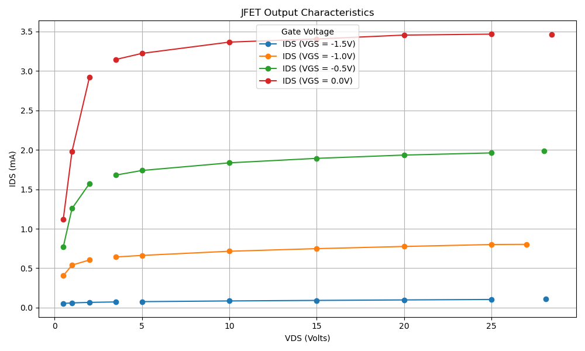

# ⚡ JFET Output Characteristics – Lab Measurement, KiCad & Python

This project documents the **manual characterization of a BF256A N-JFET transistor** through lab measurements, circuit simulation in **KiCad**, and data visualization using **Python (Matplotlib)**. It was conducted as part of my coursework in *Bauelemente und Schaltungstechnik* at Universität Siegen to strengthen my analog circuit analysis skills.

---

## 🔧 Project Overview

A common-source JFET circuit was built on a breadboard. The drain current (IDS) was measured manually at different values of **drain-source voltage (VDS)** and **gate-source voltage (VGS)** using voltmeters and ammeters.

🧠 **Goals:**
- Measure and visualize IDS vs VDS for multiple gate voltages
- Identify pinch-off region and saturation behavior
- Reinforce manual lab skills and apply Python for data handling

---

## 🔬 Lab Measurement Details

📋 Steps:
- Built the JFET test circuit using a **BF256A N-channel JFET**
- Used two potentiometers to vary **VDS** and **VGS**
- Measured **VDS**, **VGS**, and **IDS** using voltmeters and ammeter
- Recorded values manually in an Excel file

📁 Files:
- `data/JFET_output_table.xlsx` – Manually recorded values  
- `Report/Schaltungstechnik_aufgabe_2.pdf` – Final lab report  

---

## 🧰 KiCad Circuit Schematic

The test circuit was drawn in **KiCad** and follows a common-source configuration. The source is grounded, and **IDS is measured directly** using a series ammeter.

📁 Files:
- `KiCad/Common Source NJFET.kicad_sch` – Schematic  
- Other supporting KiCad project files  

📷 Schematic preview:

*(Open in KiCad to view full schematic)*

---

## 📊 Python Visualization

The Excel data was processed using a Python script to generate the IDS–VDS curves for multiple VGS values.

📁 Files:
- `Script/JFET_Characteristics.py` – Python script to load and plot  
- `Plot/jfet_plot.png` – Output plot saved by the script

📉 Preview:

---

## 📁 Folder Structure

| Folder     | Contents                                  |
|------------|-------------------------------------------|
| `data/`    | Excel sheet with manually recorded values |
| `KiCad/`   | Circuit schematic in `.kicad_sch` format  |
| `Plot/`    | Output graph as PNG image                 |
| `Report/`  | Lab report PDF                            |
| `Script/`  | Python code for plotting data             |

---
##🙋‍♂️ Author
Mainak Roy
M.Sc. Electrical Engineering
Universität Siegen, 2025

